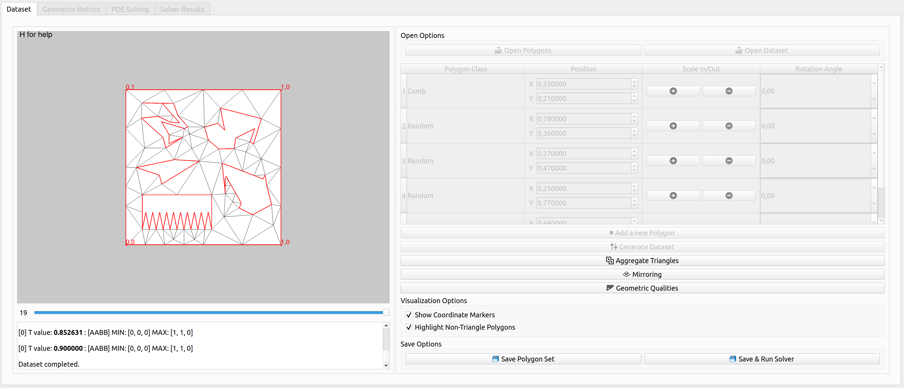

# PEMesh

A Graphical Framework to Study the Correlation between Geometric Design and Simulation.

<p align="center"></p>

## Dependencies

The framework depends on:
- the cinolib library (commit 00b270d), which is included as a submodule ;
- Triangle library, which is included as a submodule;
- Qt framework, including Qt Charts module, which is assumed to be installed on the local machine (version 5.12.0);
- Boost library, which is assumed to be installed on the local machine.

## How to make it work

Please, use --recursive when cloning this repository.

`git clone --recursive https://github.com/DanielaCabiddu/PEMesh`

PMesh can be built by running either QMake or CMake. See instriuctions below.

### QMake 

First, build triangle library

`cd external/triangle`\
`mkdir build`\
`cd build`\
`cmake ..`\
`make`

Then, build PEMesh for the repository root folder by running the following commands:

`mkdir -p build`\
`cd build`\
`qmake ../src/PMesh.pro`

### CMake

From the repository root folder, run the following commands:

`mkdir -p build`\
`cd build`\
`cmake ../src`

Triangle library will be automatically built by CMake.
 

## Other Authors
* Giuseppe Patanè (CNR IMATI), Michela Spagnuolo (CNR IMATI)

## Citing us
PEMesh has been published as a Software Paper (https://diglib.eg.org/bitstream/handle/10.2312/stag20221251/011-019.pdf?sequence=1&isAllowed=y).

If you use PEMesh in your academic projects, please consider citing it using the following BibTeX entry:

```bibtex
@inproceedings {pemesh-stag2022,
booktitle = {Smart Tools and Applications in Graphics - Eurographics Italian Chapter Conference},
editor = {Cabiddu, Daniela and Schneider, Teseo and Allegra, Dario and Catalano, Chiara Eva and Cherchi, Gianmarco and Scateni, Riccardo},
title = {{A Graphical Framework to Study the Correlation between Geometric Design and Simulation}},
author = {Cabiddu, Daniela and Patané, Giuseppe and Spagnuolo, Michela},
year = {2022},
publisher = {The Eurographics Association},
ISSN = {2617-4855},
ISBN = {978-3-03868-191-5},
DOI = {10.2312/stag.20221251}
}
```

## Acknowledgements
This paper has been realized in the framework of ERC Project CHANGE (https://cordis.europa.eu/project/id/694515), which has received funding from the European Research Council (ERC) under the European Union’s Horizon 2020 research and innovation programme (grant agreement No 694515).
